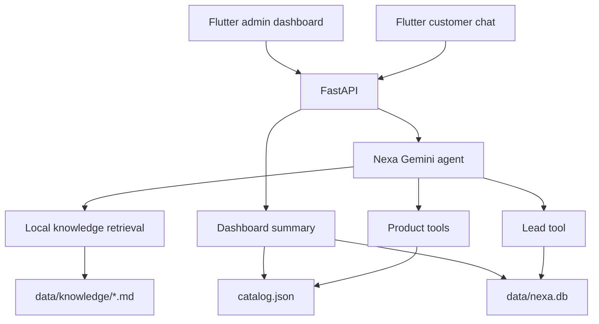

# Nexa AI Agent

Nexa is a reusable AI Sales & Customer Support Agent for organizations that want helpful product discovery and lightweight lead capture. The demo uses a fictional electronics store, but the architecture is designed to be adapted to another organization by changing catalog data, company knowledge, tools, and branding.

## Why Nexa?

Customers often need help translating a goal, budget, or policy question into a confident next step. Nexa combines conversational reasoning with verified local data: it recommends products from a catalog, answers company-policy questions from a knowledge base, and captures a qualified contact request in SQLite.

## Features

- Gemini conversational agent with multi-turn context
- Automatic function calling for product search, details, comparison, and lead capture
- Catalog-grounded product cards and comparison results
- Local Markdown RAG for returns, warranty, delivery, FAQs, and payments
- Deterministic validation before lead creation
- Persistent SQLite leads with status tracking
- FastAPI backend with clean JSON endpoints and local CORS
- Flutter customer chat and read-only admin dashboard
- Offline Python and Flutter tests

## Architecture



The Flutter clients never call Gemini and never contain the Gemini API key.

## AI Engineering Concepts

### Tool calling

Gemini chooses when to call a tool, but Python performs the real work. Product filters, product ID validation, lead validation, and SQLite writes are deterministic. Product objects returned to Flutter are compact summaries created from `catalog.json`, not generated by the model.

### Local RAG

Company policies live as Markdown files in `backend/data/knowledge/`. The backend loads and chunks them into an in-memory index, retrieves relevant chunks for a question, and gives the results to Gemini through `search_knowledge`. If no relevant chunk exists, Nexa is instructed to say that the knowledge base does not contain the answer.

### Lead workflow

When a customer asks to be contacted, Nexa collects missing name, email, and product information across the conversation. Python validates the email and product reference, then persists a `new` lead in SQLite. Leads can later be listed and moved through statuses such as `contacted` or `qualified`.

## Tech Stack

- Python 3.12, Gemini `google-genai`, python-dotenv
- FastAPI, Pydantic, Uvicorn
- SQLite, standard-library deterministic services
- Flutter/Dart and the lightweight `http` package
- Pytest and Flutter widget tests

## Project Structure

```text
nexa-ai-agent/
├── backend/
│   ├── api.py                    # FastAPI routes
│   ├── agent.py                  # Gemini agent and tools
│   ├── product_service.py        # Catalog loading and filtering
│   ├── knowledge_service.py      # Local chunking and retrieval
│   ├── lead_service.py           # SQLite persistence and validation
│   ├── catalog.json              # Fictional electronics catalog
│   ├── data/knowledge/           # Company policy documents
│   └── test_*.py                 # Offline backend tests
├── flutter_app/
│   ├── lib/main.dart             # Customer chat and app shell
│   ├── lib/api_service.dart      # FastAPI chat client
│   ├── lib/dashboard_*.dart      # Admin data and UI
│   └── test/widget_test.dart     # Flutter widget tests
├── docs/screenshots/             # Add real screenshots here
├── LICENSE
└── README.md
```

## Setup

Create the Python environment and install backend dependencies:

```bash
cd nexa-ai-agent/backend
python3 -m venv .venv
source .venv/bin/activate
pip install -r requirements.txt
cp .env.example .env
```

Set `GEMINI_API_KEY` in `backend/.env`. Keep this file private; it is ignored by Git. The SQLite database is created automatically at `backend/data/nexa.db`.

Install Flutter dependencies:

```bash
cd ../flutter_app
flutter pub get
```

## Run Backend

From `nexa-ai-agent/backend/`:

```bash
source .venv/bin/activate
uvicorn api:app --reload --host 127.0.0.1 --port 8000
```

## Run Flutter

From `nexa-ai-agent/flutter_app/`:

```bash
flutter run --dart-define=API_BASE_URL=http://127.0.0.1:8000
```

For an Android emulator, use `http://10.0.2.2:8000`. For a physical device, use the Mac's LAN address and start Uvicorn with `--host 0.0.0.0`.

## API Overview

- `GET /health`
- `POST /chat`
- `GET /products`
- `GET /products/{product_id}`
- `GET /leads`
- `PATCH /leads/{lead_id}/status`
- `GET /dashboard/summary`

## Tests

Backend tests do not call Gemini:

```bash
cd nexa-ai-agent/backend
source .venv/bin/activate
python -m pytest -q
```

Flutter checks:

```bash
cd nexa-ai-agent/flutter_app
flutter analyze
flutter test
```

## Example Conversations

- “I need a phone under 80,000 PKR. Camera and battery matter most.”
- “Compare the first two options.”
- “What is your return policy? Can opened products be returned?”
- “I’m interested in the Nexa Photon X1. Have someone contact me.”
- “My name is Arfa and my email is arfahere@example.com.”

## Screenshots

Real, non-sensitive screenshots from the app:


Add the comparison screenshot as `docs/screenshots/product-comparison.png` when available.

## Demo Video

Add a real recording link here when available: `[Watch the Nexa demo](VIDEO_URL)`.

## Limitations

- The electronics catalog and company policies are fictional demo data.
- Chat sessions are stored in memory and reset when the backend restarts.
- SQLite is local and the admin area has no authentication yet.
- Local retrieval is intentionally lightweight keyword/semantic matching rather than a production embedding service.
- Product reservations, checkout, payments, and inventory synchronization are not implemented.

## Future Improvements

- Organization-specific configuration and branding
- Authentication and role-based admin access
- Production vector retrieval and evaluation datasets
- CRM integration and lead notifications
- Real inventory, checkout, and order support integrations

## Portfolio Positioning

Nexa demonstrates a practical path from a conversational AI prototype to a reusable business system: grounded recommendations, policy retrieval, validated business actions, an API boundary, and customer/admin interfaces. The fictional electronics store is only the demo vertical; the same core can be adapted for another organization's catalog, documents, workflows, and brand.
