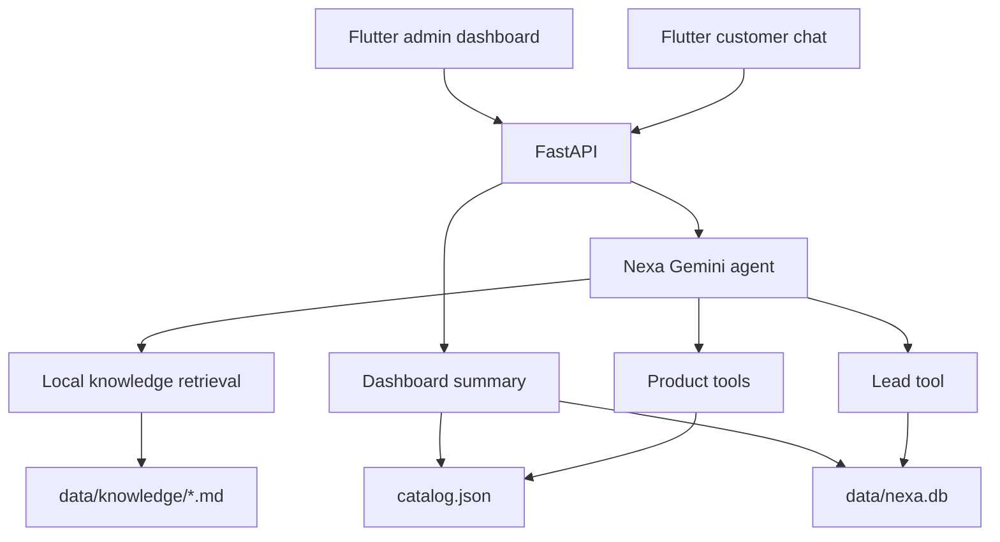
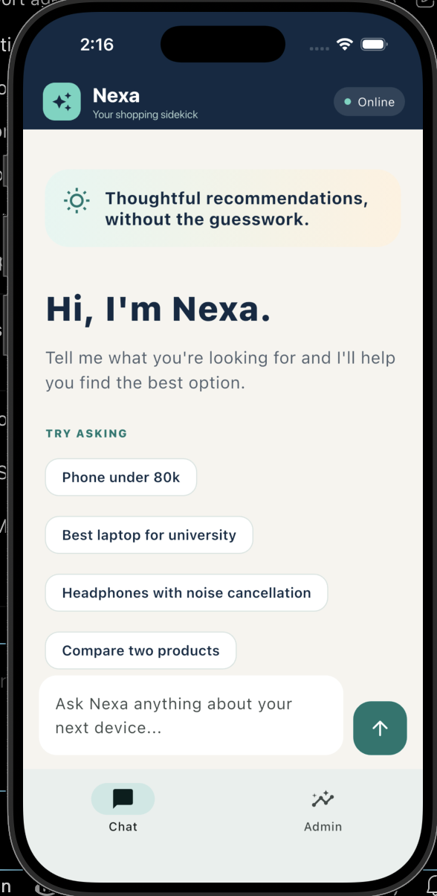
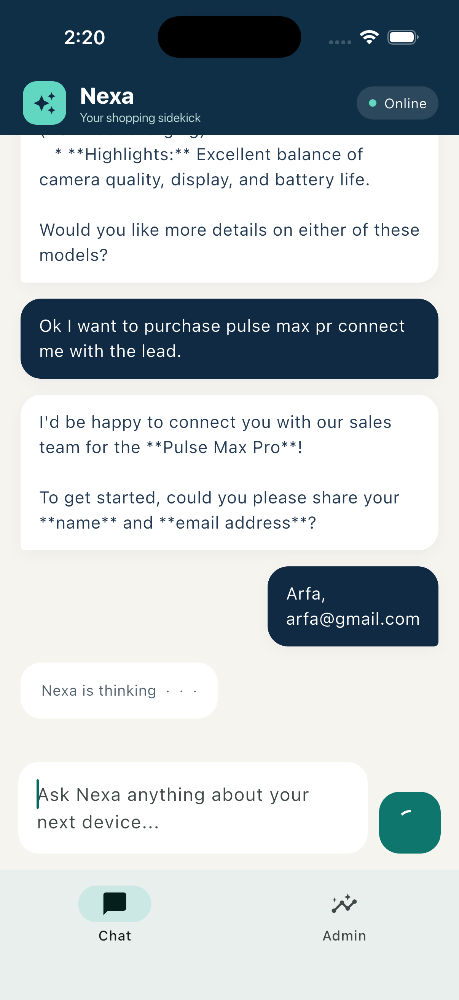
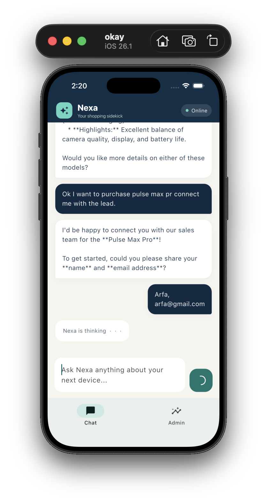
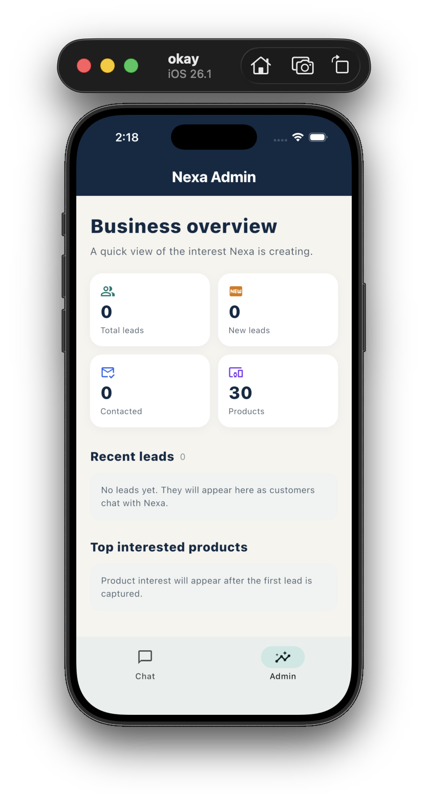

# Nexa — AI Sales & Customer Support Agent

A reusable AI agent for product discovery, policy questions, and lightweight lead capture. Nexa combines conversational reasoning with verified local data: it recommends products from a catalog, answers company-policy questions from a knowledge base, and captures qualified contact requests in SQLite.

The demo uses a fictional electronics store, but the architecture is built to be re-pointed at another organization by swapping catalog data, knowledge documents, tools, and branding — without rewriting the agent.

**Live demo:** _add your deployed URL here_
**Stack:** Python · FastAPI · Gemini · SQLite · Flutter · Dart

---

## The Core Idea

The model interprets; the backend decides.

Gemini chooses *when* to call a tool, but Python does the real work. Product filtering, ID validation, email validation, and database writes are all deterministic. Product objects returned to the client are compact summaries built from `catalog.json` — never generated by the model. The Flutter clients don't call Gemini and never hold the API key.

## Features

- Gemini conversational agent with multi-turn context
- Automatic function calling for product search, details, comparison, and lead capture
- Catalog-grounded product cards and comparison results
- Local Markdown RAG for returns, warranty, delivery, FAQs, and payments
- Explicit no-answer response when no relevant knowledge chunk is retrieved
- Deterministic validation before any lead is created
- Persistent SQLite leads with status tracking
- FastAPI backend with clean JSON endpoints
- Flutter customer chat and read-only admin dashboard
- Offline Python and Flutter tests that run without calling the model

## Architecture



## How It Works

### Tool calling

The agent exposes a set of typed tools to Gemini. When a customer asks for "a phone under 80,000 PKR with a good camera," the model selects the product search tool and supplies parameters; Python applies the filters against `catalog.json` and returns real records. The model then explains the results. It never invents a product, price, or specification.

### Local RAG

Company policies live as Markdown files in `backend/data/knowledge/`. The backend loads and chunks them into an in-memory index, retrieves relevant chunks for a question, and passes them to Gemini through `search_knowledge`. If no chunk clears the relevance bar, the agent is instructed to state that the knowledge base does not cover the question rather than guessing — an important property for anything answering warranty or returns questions.

### Lead workflow

When a customer asks to be contacted, Nexa gathers the missing name, email, and product reference across the conversation. Python then validates the email format and confirms the product ID exists before persisting a `new` lead to SQLite. Leads can be listed and moved through statuses such as `contacted` and `qualified` from the admin dashboard.

## Tech Stack

- Python 3.12, Gemini (`google-genai`), python-dotenv
- FastAPI, Pydantic, Uvicorn
- SQLite with standard-library deterministic services
- Flutter / Dart with the lightweight `http` package
- pytest and Flutter widget tests

## Project Structure

```text
nexa-ai-agent/
├── backend/
│   ├── api.py                    # FastAPI routes
│   ├── agent.py                  # Gemini agent and tool definitions
│   ├── product_service.py        # Catalog loading and filtering
│   ├── knowledge_service.py      # Chunking and retrieval
│   ├── lead_service.py           # SQLite persistence and validation
│   ├── catalog.json              # Demo electronics catalog
│   ├── data/knowledge/           # Company policy documents
│   └── test_*.py                 # Offline backend tests
├── flutter_app/
│   ├── lib/main.dart             # Customer chat and app shell
│   ├── lib/api_service.dart      # FastAPI chat client
│   ├── lib/dashboard_*.dart      # Admin data and UI
│   └── test/widget_test.dart     # Flutter widget tests
├── docs/screenshots/
├── LICENSE
└── README.md
```

## Setup

### Backend

```bash
cd nexa-ai-agent/backend
python3 -m venv .venv
source .venv/bin/activate
pip install -r requirements.txt
cp .env.example .env          # then set GEMINI_API_KEY
```

The SQLite database is created automatically at `backend/data/nexa.db`. Keep `.env` private; it is gitignored.

Run the backend:

```bash
uvicorn api:app --reload --host 127.0.0.1 --port 8000
```

### Flutter

```bash
cd nexa-ai-agent/flutter_app
flutter pub get
flutter run --dart-define=API_BASE_URL=http://127.0.0.1:8000
```

For an Android emulator use `http://10.0.2.2:8000`. For a physical device, use your machine's LAN address and start Uvicorn with `--host 0.0.0.0`.

## API Overview

| Method | Endpoint | Description |
|---|---|---|
| `GET` | `/health` | Health check |
| `POST` | `/chat` | Send a customer message, receive the agent response |
| `GET` | `/products` | List catalog products |
| `GET` | `/products/{product_id}` | Product detail |
| `GET` | `/leads` | List captured leads |
| `PATCH` | `/leads/{lead_id}/status` | Update lead status |
| `GET` | `/dashboard/summary` | Aggregate catalog and lead metrics |

## Tests

Backend tests run entirely offline and do not call Gemini:

```bash
cd nexa-ai-agent/backend
source .venv/bin/activate
python -m pytest -q
```

Flutter checks:

```bash
cd nexa-ai-agent/flutter_app
flutter analyze
flutter test
```

## Example Conversations

- "I need a phone under 80,000 PKR. Camera and battery matter most."
- "Compare the first two options."
- "What is your return policy? Can opened products be returned?"
- "I'm interested in the Nexa Photon X1. Have someone contact me."

## Screenshots

| | |
|---|---|
|  |  |
|  |  |

## Limitations

- The catalog and company policies are demo data.
- Chat sessions are held in memory and reset when the backend restarts.
- Retrieval uses lightweight in-memory matching rather than a vector database.
- The admin area has no authentication.
- Reservations, checkout, payments, and inventory sync are out of scope.

## Roadmap

- Production vector retrieval with an evaluation dataset and retrieval metrics
- Authentication and role-based admin access
- Per-organization configuration and branding
- CRM integration and lead notifications
- Inventory, checkout, and order support integrations
